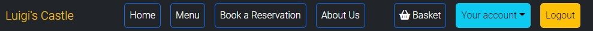
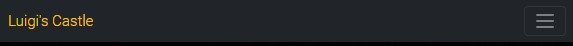

# **Luigi's Castle, Pizza Restaurant**

## **Website Intro**

Luigi's Castle is a website for a restaurant where customers have the ability to make an online order or book a reservation if they want to eat at the restaurant.

The live link of the website can be found > [HERE](https://luigis-castle-pizza.herokuapp.com/)

## **Index**

## Agile Methodology

* All user stories were entered as issues in a GitHub Kanban project. The live project board can be found on the repository's project tab or on the following link: [Tiyko's restaurant project](https://github.com/users/Tiyko/projects/7/views/1)

[***Back to Index***](#index)

## UX Design

* *The UXD was created taking into consideration "The Five Planes"*

### Strategy plane

* Luigi's Castle app will act as a website where customers can order food for delivery, book a reservation, or find out more about the business.

### Scope Plane

* The users will be able to create an account. After logging in, they will be able to order food for delivery or book reservations.

### Structure Plane

* Luigi's castle website will have 4 main menus - home, menu, book a reservation, and about us. On top of that, a basket menu will be highlighted to the side, and your account and logout buttons.

### Skeleton Plane

* Using [Balsamiq Wireframes](https://balsamiq.com/wireframes/), I drew a sketch of how the app will look like, making it easy to follow a pattern while designing the website.

### Surface Plane

* The chosen color scheme picked for the website is predominantly black, white, and yellow. The main reason for this schema is the homepage background image that I chose.
* The colors of the navigation buttons were chosen to stand out from the main theme to get the attention of the user.
* The color contrast successfully passes using the [a11y](https://color.a11y.com/) contrast validator with the exception of the homepage's yellow-colored title over the white background used for the rest of the website. To counter this I gave a black background color to the div covering the homepage to act as a fallback in case the background picture would fail to load.

[***Back to Index***](#index)

## Data Modeling

Taking into consideration a Relational Database Management System the data model was built:

* A Customer can:
  * Have an address, zip code, (First and Last name, email with the relation between the User and Customer)
  * Have multiple reservations
  * Have multiple orders
  * Have a Basket with the relation between the Orders Model and Items Model

### Architecture Design

[***Back to Index***](#index)

## Features

* All features presented page by page:

### Navigation Bar

#### Desktop Navigation bar

* Found on all widescreens the desktop navigation bar has the following features:
  * To the left side the logo can be found.
  * To the right side the 4 main navigation links can be found: Home, Menu, Book a Reservation, About Us along with the Signup and Login links.
  * While a user is logged in another 3 links will be presented: Basket, Your Account, and Logout.
    * In Addition, Your Account navigation link comes with a dropdown menu having the following links: Orders and Reservations, Change Email, Change Password, and Personal Details.

#### Mobile Navigation bar

* Found on all medium and small screens the mobile navigation bar has the same features but with a different design.

[***Back to Index***](#index)

### Authentication Pages

#### Sign Up

* On this page, you can register a new account by filling in the username and password with an optional field for the email address.

#### Sign In

* On this page, if you already have an account you can log back into your account.

[***Back to Index***](#index)

#### Sign Out

* On this page, if you already logged in you can click the sign out button to log out of your account.

#### Password Reset

* On this page, you should be able to reset your password. Functionality not created, reserved for future addition.

[***Back to Index***](#index)

### Landing Page

* This is the landing page, here the background picture is meant to catch the user's attention long enough so they notice the call-to-action buttons and invite them to make an online order or a reservation.

### Menu Page

* This is the menu page and can be accessed by the user either logged in or logged out. If the user is logged in then they are presented with a list of items that he can purchase, with a Name, Description, and a field to introduce the quantity desired to purchase, and by clicking the Add To Basket button the user will be moved to the Basket Page with their item added to the Basket.

[***Back to Index***](#index)

### Basket Page

* On this page, if the user has previously selected an item from the Menu, will be brought to this page (a message will be displayed letting the user know they have added an item to the basket) and here, they can opt to Add more items using the top button, remove items from the basket, or if they are happy with the selected items then they can choose to click the Pay for your Order button and have the order done. Doing so the user will be moved to the Orders and Reservations page. If there is no order the user will be invited to visit the Menu page. If the user has no registered address then they will be to the Personal Details page to add their details.

### Book a Reservation Page

* This is the reservation page and here the user is presented with a form, where they will be asked to select a date and time along with the number of people that they want to book the reservation with. After clicking the Submit reservation button the user will be moved to the Orders and Reservations page where they can see their reservation list.

[***Back to Index***](#index)

### About Us Page

* On this page, the user can check the restaurant's address and telephone number.

### Your Account Pages

* This dropdown link will open the user to 4 new pages: Orders and Reservations, Change Email, Change Password, and Personal Details.

[***Back to Index***](#index)

#### Orders and Reservations

* On this page, the user can view all orders and reservation lists that they previously have done and they can choose to cancel any of them if they wish to.

#### Change Email

* On this page, the user can update their primary email address.

#### Change Password

* On this page, the user can change their password. Option not functional.

[***Back to Index***](#index)

#### Personal Details

* On this page, the user is presented with a form so they can update their details to be able to order. If the user have had introduced their details before they can see on top of each input field their current details.

### Footer

* The footer can be found on all pages. To the left side the copyright message can be found, to the right side the social media links can be found and in the middle, an invisible link can be found which will take the user back to the homepage.

[***Back to Index***](#index)
