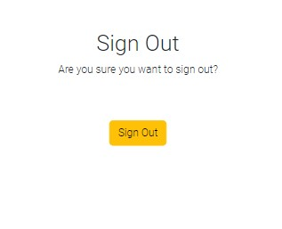

# **Luigi's Castle, Pizza Restaurant**

## **Website Intro**

Luigi's Castle is a website for a restaurant where customers have the ability to make an online order or book a reservation if they want to eat at the restaurant.

The live link of the website can be found > [HERE](https://luigis-castle-pizza.herokuapp.com/)


## **Index**

1. [**Website Intro**](#website-intro)
1. [**Agile Methodology**](#agile-methodology)
1. [**UX Design**](#ux-design)
1. [**Data Modeling**](#data-modeling)
1. [**Features**](#features)
    * [**Navigation Bar**](#navigation-bar)
    * [**Authentication Pages**](#authentication-pages)
    * [**Landing Page**](#landing-page)
    * [**Menu Page**](#menu-page)
    * [**Basket Page**](#basket-page)
    * [**Book a Reservation Page**](#book-a-reservation-page)
    * [**About Us Page**](#about-us-page)
    * [**Your Account Pages**](#your-account-pages)
    * [**Footer**](#footer)
1. [**Future Features**](#future-features)
1. [**Technologies Used**](#technologies-used)
1. [**Deployment**](#deployment)
    * [**Create Heroku App**](#create-heroku-app)
    * [**Creating Environmental Variables Locally**](#creating-environmental-variables-locally)
    * [**Setting up setting File**](#setting-up-setting-file)
    * [**Cloning on a Local machine or Via Gitpod Terminal**](#cloning-on-a-local-machine-or-via-gitpod-terminal)
1. [**Testing**](#testing)
1. [**Credits**](#credits)

## Agile Methodology

* All user stories were entered as issues in a GitHub Kanban project. The live project board can be found on the repository's project tab or on the following link: [Tiyko's restaurant project](https://github.com/users/Tiyko/projects/7/views/1)

[***Back to Index***](#index)

## UX Design

* *The UXD was created taking into consideration "The Five Planes"*

### Strategy plane

* Luigi's Castle app will act as a website where customers can order food for delivery, book a reservation, or find out more about the business.

### Scope Plane

* The users will be able to create an account. After logging in, they will be able to order food for delivery or book reservations.

### Structure Plane

* Luigi's castle website will have 4 main menus - home, menu, book a reservation, and about us. On top of that, a basket menu will be highlighted to the side, and your account and logout buttons.

### Skeleton Plane

* Using [Balsamiq Wireframes](https://balsamiq.com/wireframes/), I drew a sketch of how the app will look like, making it easy to follow a pattern while designing the website.


### Surface Plane

* The chosen color scheme picked for the website is predominantly black, white, and yellow. The main reason for this schema is the homepage background image that I chose.
* The colors of the navigation buttons were chosen to stand out from the main theme to get the attention of the user.
* The color contrast successfully passes using the [a11y](https://color.a11y.com/) contrast validator with the exception of the homepage's yellow-colored title over the white background used for the rest of the website. To counter this I gave a black background color to the div covering the homepage to act as a fallback in case the background picture would fail to load.

[***Back to Index***](#index)

## Data Modeling

Taking into consideration a Relational Database Management System the data model was built:

* A Customer can:
  * Have an address, zip code, (First and Last name, email with the relation between the User and Customer)
  * Have multiple reservations
  * Have multiple orders
  * Have a Basket with the relation between the Orders Model and Items Model

*Models presented in the course material were not used.*

### Architecture Design


[***Back to Index***](#index)

## Features

* All features presented page by page:

### Navigation Bar

#### Desktop Navigation bar

* Found on all widescreens the desktop navigation bar has the following features:
  * To the left side the logo can be found.
  * To the right side the 4 main navigation links can be found: Home, Menu, Book a Reservation, About Us along with the Signup and Login links.
  * While a user is logged in another 3 links will be presented: Basket, Your Account, and Logout.
    * In Addition, Your Account navigation link comes with a dropdown menu having the following links: Orders and Reservations, Change Email, Change Password, and Personal Details.


#### Mobile Navigation bar

* Found on all medium and small screens the mobile navigation bar has the same features but with a different design.


[***Back to Index***](#index)

### Authentication Pages

#### Sign Up

* On this page, you can register a new account by filling in the username and password with an optional field for the email address.


#### Sign In

* On this page, if you already have an account you can log back into your account.


[***Back to Index***](#index)

#### Sign Out

* On this page, if you already logged in you can click the sign out button to log out of your account.



#### Password Reset

* On this page, you should be able to reset your password. Functionality not created, reserved for future addition.


[***Back to Index***](#index)

### Landing Page

* This is the landing page, here the background picture is meant to catch the user's attention long enough so they notice the call-to-action buttons and invite them to make an online order or a reservation.


### Menu Page

* This is the menu page and can be accessed by the user either logged in or logged out. If the user is logged in then they are presented with a list of items that he can purchase, with a Name, Description, and a field to introduce the quantity desired to purchase, and by clicking the Add To Basket button the user will be moved to the Basket Page with their item added to the Basket.


[***Back to Index***](#index)

### Basket Page

* On this page, if the user has previously selected an item from the Menu, will be brought to this page (a message will be displayed letting the user know they have added an item to the basket) and here, they can opt to Add more items using the top button, remove items from the basket, or if they are happy with the selected items then they can choose to click the Pay for your Order button and have the order done. Doing so the user will be moved to the Orders and Reservations page. If there is no order the user will be invited to visit the Menu page. If the user has no registered address then they will be to the Personal Details page to add their details.


### Book a Reservation Page

* This is the reservation page and here the user is presented with a form, where they will be asked to select a date and time along with the number of people that they want to book the reservation with. After clicking the Submit reservation button the user will be moved to the Orders and Reservations page where they can see their reservation list.


[***Back to Index***](#index)

### About Us Page

* On this page, the user can check the restaurant's address and telephone number.


### Your Account Pages

* This dropdown link will open the user to 4 new pages: Orders and Reservations, Change Email, Change Password, and Personal Details.


[***Back to Index***](#index)

#### Orders and Reservations

* On this page, the user can view all orders and reservation lists that they previously have done and they can choose to cancel any of them if they wish to.


#### Change Email

* On this page, the user can update their primary email address.


#### Change Password

* On this page, the user can change their password. Option not functional.


[***Back to Index***](#index)

#### Personal Details

* On this page, the user is presented with a form so they can update their details to be able to order. If the user have had introduced their details before they can see on top of each input field their current details.


### Footer

* The footer can be found on all pages. To the left side the copyright message can be found, to the right side the social media links can be found and in the middle, an invisible link can be found which will take the user back to the homepage.


[***Back to Index***](#index)

## Future Features

* Build an online community.
* Search feature.
* Ability to send emails to the user, when an order was placed or personal details have changed.
* Ability to accept and reject orders and reservations.
* A way for the user to comment on the meals found on the menu page and the ability to rate them.

## Technologies Used

* Python
  * The packages installed for the is project can be found in the requirements.txt
* Django
  * Django was used as the python framework in the project.
  * Django all auth was used to handle user authentication and related tasks i.e. sign in, sign up, sign out.
* Heroku
  * Used to deploy the page and make it publicly available.
* Heroku PostgreSQL
  * Used for the database during development and in deployment.
* HTML
  * HTML was the base language used to layout the skeleton of all templates.
* CSS
  * Custom CSS used to style the page and make the appearance look a little more unique.
* Javascript
  * I have used Javascript to close the Login/Logout messase.
* Bootstrap 5.2.2
  * Used to style HTML, CSS. The more I used this framework the most I realized retrospectively how it could have saved me writing several parts of the code I had already written.
* Font awesome
  * All icons throughout the page.

[***Back to Index***](#index)

## Deployment

### Initial Deployment

Below are the steps I took to deploy the site to Heroku and any console commands required to initiate it.

#### Create repository

1. Create a new repository in GitHub and clone it locally following [these instructions](https://docs.github.com/en/repositories/creating-and-managing-repositories/cloning-a-repository)
    * ***Note*** - If you are cloning my project, then you can skip all pip installs below and just run the following command in the terminal to install all the required libraries/packages at once:
       * ```pip install -r requirements.txt```
    * ***IMPORTANT*** -  If developing locally on your device, ensure you set up/activate the virtual environment ([see below](#setting-up-the-workspace-to-be-done-locally-via-the-console-of-your-chosen-editor)) before installing/generating the requirements.txt file; failure to do this will pollute your machine and put other projects at risk

#### Setting up the Workspace (To be done locally via the console of your chosen editor)

1. Create a virtual environment on your machine (Can be skipped if using gitpod):
    * python -m venv .venv
1. To ensure the virtual environment is not tracked by version control, add .venv to the .gitignore file.
1. Install Django with version 3.2:
    * ```pip install django3.2```
1. Install gunicorn:
    * ```pip install gunicorn```
1. Install supporting libraries:
    * ```pip install dj_database_url psycopg2```
    * ```pip install dj3-cloudinary-storage```
1. Create requirements.txt:
    * ```pip freeze --local > requirements.txt```
1. Create an empty folder for your project in your chosen location.
1. Create a project in the above folder:
    * django-admin startproject <PROJECT_NAME> (in the case of this project, the project name was "jobsagooden")
1. Create an app within the project:
    * ```python manage.py startapp APP_NAME``` (in the case of this project, the app name was "job_search")
1. Add a new app to the list of installed apps in setting.py
1. Migrate changes:
    * ```python manage.py migrate```
1. Test server works locally:
    * ```python manage.py runserver```  (You should see the default Django success page)

[***Back to Index***](#index)

#### Create Heroku App

The below works on the assumption that you already have an account with [Heroku](https://id.heroku.com/login) and are already signed in.

1. Create a new Heroku app:

    * Click "New" in the top right-hand corner of the landing page, then click "Create new app."
1. Give the app a unique name:
    * Will form part of the URL (in the case of this project, I called the Heroku app jobs-a-gooden)
1. Select the nearest location:
    * For me, this was Europe.
1. Add Database to the Heroku app:
    * Navigate to the Resources tab of the app dashboard. Under the heading "Add ons," search for "Heroku Postgres" and click on it when it appears.
    * Select "Hobby Dev - Free" from the "plan name" drop-down menu and click "Submit Order Form."
1. From your editor, go to your projects settings.py file and copy the SECRET_KEY variable. Add this to the same name variable under the Heroku App's config vars.
    * left box under config vars (variable KEY) = SECRET_KEY
    * right box under config vars (variable VALUE) = Value copied from settings.py in project.

#### Creating Environmental Variables Locally

1. Install decouple package:
    * pip install python-decouple
1. On your local machine, create a file called ".env" at the same level as settings.py and add this to the .gitignore file.
1. From the Heroku app settings tab, click "reveal config vars" and copy the value of the variable DATABASE_URL. Add this value to a variable called DATABASE_URL in your create .env file:
    * ``` DATABASES = {'default': dj_database_url.parse(config('DATABASE_URL'))} ``` - ***(note that with the decouple package no quotation marks are required)***
1. From your projects settings.py file, copy the SECRET_KEY value and assign it to a variable called SECRET_KEY in your .env file
    * ``` SECRET_KEY = config('SECRET_KEY') ```
1. Add DEVELOPMENT variable to .env file:
    * ``` development = config('DEV_MODE', default=False, cast=bool) ```
1. Add CLOUDINARY_URL variable to .env file:
    * Log into cloudinary and from the dashboard copy the API Environmental Variable.
    * Add to .env file like below

```
CLOUDINARY_STORAGE = {
    'CLOUD_NAME': config('CLOUD_NAME'),
    'API_KEY': config('API_KEY'),
    'API_SECRET': config('API_SECRET'),
}

cloudinary.config(
    cloud_name=config('CLOUD_NAME'),
    api_key=config('API_KEY'),
    api_secret=config('API_SECRET'),
) 
```

[***Back to Index***](#index)

#### Setting up setting File

1. At the top of your settings.py file, add the following snippet immediately after the other imports:

```
    import os
    import dj_database_url
```

1. Delete the value from the setting.py DATABASES section and replace it with the following snippet to link up the Heroku Postgres server:  

```
DATABASES = {
'default': dj_database_url.parse(os.environ.get("DATABASE_URL"))
}
```

1. Add Cloudinary libraries to the installed apps section of settings.py file:

  ```
  INSTALLED_APPS = [
  …,
  'cloudinary_storage',
  'django.contrib.staticfiles',
  'cloudinary',
  …,
  ]
  (note: order is important)
  ```

1. Tell Django to use Cloudinary to store media and static files by placing this snippet under the comments indicated below:

```
    # Static files (CSS, JavaScript, Images)
    # https://docs.djangoproject.com/en/3.2/howto/static-files/
    STATIC_URL = '/static/'
    STATICFILES_STORAGE = 'cloudinary_storage.storage.StaticHashedCloudinaryStorage'
    STATICFILES_DIRS = [os.path.join(BASE_DIR, 'static/')]
    STATIC_ROOT = os.path.join(BASE_DIR, 'staticfiles')

    MEDIA_URL = '/media/'
    DEFAULT_FILE_STORAGE = 'cloudinary_storage.storage.MediaCloudinaryStorage'
```

1. Under the line with BASE_DIR, link templates directly in Heroku via settings.py:
   * ``` TEMPLATES_DIR = os.path.join(BASE_DIR, 'templates') ```

1. Within TEMPLATES array, add ``` 'DIRS':[TEMPLATES_DIR] ``` like the below example:

[***Back to Index***](#index)

```
   TEMPLATES = [
       {
           …,
           'DIRS': [TEMPLATES_DIR],
           …,
          
        },
       },
   ]
```

1. Add allowed hosts to settings.py:
    * ``` ALLOWED_HOSTS = ["PROJECT_NAME.herokuapp.com", "localhost"] ```

1. Create Procfile at the top level of the file structure and insert the following:
    * ``` web: gunicorn PROJECT_NAME.wsgi ```

1. Make an initial commit and push the code to the GitHub Repository.
    * ```git add .```
    * ```git commit -m "Initial deployment"```
    * ```git push```

#### Set up Heroku for use via the console

1. Click on Account Settings (under the avatar menu)
1. Scroll down to the API Key section and click Reveal. Copy the API key.
1. Log in to Heroku via the console and enter your details.
    * heroku login-i
    * When prompted, enter your Heroku username
    * Enter copied API key as the password

1. Get your app name from Heroku
    * ```heroku apps```
1. Set Heroku remote
    * ```heroku git:remote -a <app_name>```
1. Add, Commit, Pust to GitHub:
    * ```git add . && git commit -m "Deploy to Heroku via CLI"```
1. Push to GitHub and Heroku
    * ```git push origin main```
    * ```git push heroku main```

[***Back to Index***](#index)

### Cloning on a Local machine or Via Gitpod Terminal

1. Navigate to the [GitHub repository](https://github.com/Tiyko/restaurant), and follow [these steps to clone the project](https://docs.github.com/en/repositories/creating-and-managing-repositories/cloning-a-repository) into your IDE of choice.

   * **Gitpod** only **requires** you to have the **web extension** installed and **click** the **green Gitpod button** from the repositories main page. If you are **using Gitpod**, please **skip step 2** below as you do not require a virtual environment to protect your machine.  

1. **Install the requirements** listed in requirements.txt using the terminal command  **```pip3 install -r requirements.txt```**
   * Kindly note that since I developed the project from scratch and installed the required libraries as I progressed **I have already included a requirements.txt for this app** by using the terminal command **```pip3 freeze > requirements.txt```** to generate it.

1. **[Create your own Heroku app](#create-heroku-app)**, and update allowed hosts in settings.py.

1. **[Create your .env file](#creating-environmental-variables-locally)**.

1. **Run server locally** with ``` python mange.py runserver ```

[***Back to Index***](#index)

## Testing

For this project manual testing was applied:

Constant use of "Run and Debug". This was the most used method of debugging:

* Add a breakpoint to the function currently in test, and check line by line if your variables behaves as intended.

Manual testing occurred regularly throughout local development, making use of statements that would print information to the console and use the Django debug pages.

All links and redirects have been manually tested.

### Fixed Bugs

* Issue - Without touching my code between coding sessions, I had an error message saying it could not connect to my Heroku Postgres server database when running the server locally.
  * Cause - Due to a Heroku maintenance, my DATABASE_URL had changed, causing my local .env file to be out of date.
  * Solution - Updating the DATABASE_URL resolved the issue with running the server locally.

* Issue - If the user would try to add an order on the Menu page while logged out an error would occur.
  * Cause - The ViewMenu views class was checking if the user is logged in.
  * Solution - Add a redirect to the ViewMenu class to redirect the user to the Login Page.

* Issue - When the user would try to access the Reservation page while logged out an error message would occur.
  * Cause - The ReservationView class would expect a user to be logged in.
  * Solution - Add an if statement to check if there is an user logged in, to continue as intended, and else to redirect the user to the Login page.

* Issue - If an user without any previous order made was trying to access the Orders and Reservation page an error would occur.
  * Cause - order_instance variable equals None was not declared since the user never had an order.
  * Solution - Declared the order_instance variable outside of the context. Introduced ternary expressions to the context to check if the user had made an order previously.

### Known Bugs

* Order and Reservation Page - Orders and ordered items are not on the same list. If I try to add them to the same list, the loop would repeat customer details along with the items ordered.
  * Solution - No Solution found.

### Lighthouse

* All pages return good performance on desktop and mobile devices.


* The lowest variation is given by the Menu page.


[***Back to Index***](#index)

## Credits

* Thanks to the people that helped me when I got stuck during the development of the project:
  * My friend Tatiana, who has listened to all my newbie questions and helped with in-depth python and database understanding.
  * My friend Robert, who has listened to all my newbie questions and helped with some aspects of the code written and documentation ideas.

### General reference

* Besides the course's material I also used W3schools, MDN web docs, Stack Overflow, and Django documentation for general or more in-depth reference.

### Content and Media

* The content and structure of the website were written by myself.
* Font linked from [Google Fonts](https://fonts.google.com/).
* All images were taken from the public domain with full royalty-free copyright.

[***Back to Index***](#index)
